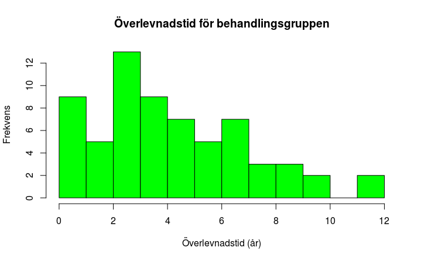
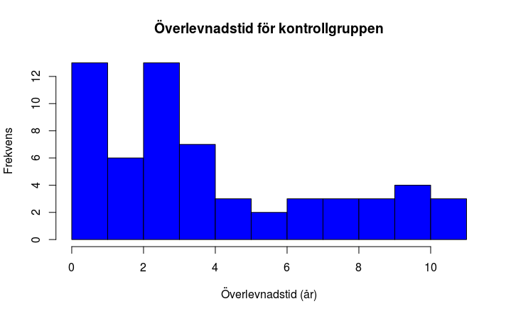
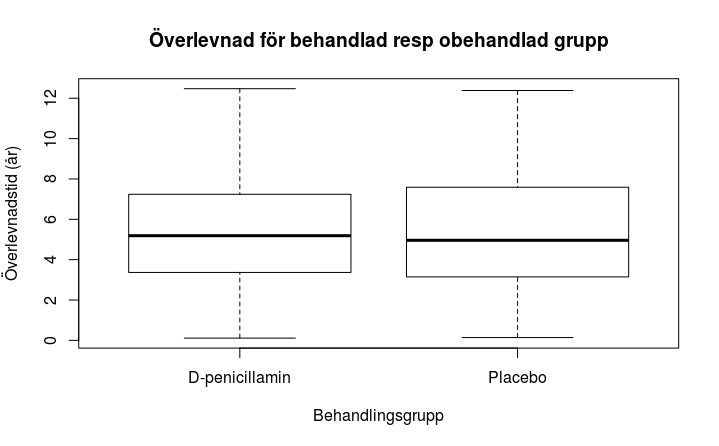
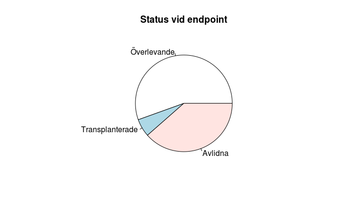

# pbcpkg
## Detta är den andra VG-uppgiften i "Statistiska metoder med R" vt 18.
### Installation
Installera och ladda biblioteket devtools som möjliggör nedladdning av paket från github. Därefter laddas paketet ner och installeras.
```
install.packages("devtools")
library(devtools)
install_github("magmarv18/pbcpkg")
library(pbcpkg)
```

För att besvara frågeställningen, kör kommandot
```
trt.survival()
```

### Datasetet
Datasetet är "Mayo Clinic Primary Biliary Cirrhosis Data", som bäst beskrivs enligt följande:

This data is from the Mayo Clinic trial in primary biliary cirrhosis (PBC) of the liver conducted between 1974 and 1984. A total of 424 PBC patients, referred to Mayo Clinic during that ten-year interval, met eligibility criteria for the randomized placebo controlled trial of the drug D-penicillamine. The first 312 cases in the data set participated in the randomized trial and contain largely complete data. The additional 112 cases did not participate in the clinical trial, but consented to have basic measurements recorded and to be followed for survival. Six of those cases were lost to follow-up shortly after diagnosis, so the data here are on an additional 106 cases as well as the 312 randomized participants. 

Innehåll:

age:	in years

albumin:	serum albumin (g/dl)

alk.phos:	alkaline phosphotase (U/liter)

ascites:	presence of ascites

ast:	aspartate aminotransferase, once called SGOT (U/ml)

bili:	serum bilirunbin (mg/dl)

chol:	serum cholesterol (mg/dl)

copper:	urine copper (ug/day)

edema:	0 no edema, 0.5 untreated or successfully treated,	1 edema despite diuretic therapy

hepato:	presence of hepatomegaly or enlarged liver

id:	case number

platelet:	platelet count

protime:	standardised blood clotting time

sex:	m/f

spiders:	blood vessel malformations in the skin

stage:	histologic stage of disease (needs biopsy)

status:	status at endpoint, 0/1/2 for censored, transplant, dead

time: 	number of days between registration and the earlier of death, transplantion, or study analysis in July, 1986

trt:	1/2/NA for D-penicillamine, placebo, not randomised

trig:	triglycerides (mg/dl)


Hämtat från: http://www-eio.upc.edu/~pau/cms/rdata/csv/survival/pbc.csv (2018-03-28)

Referens: https://stat.ethz.ch/R-manual/R-devel/library/survival/html/pbc.html

Se även ? pbcdata

### Fråga
Föreligger en skillnad i överlevnadstid mellan grupperna läkemedels- resp placebo-behandlade hos patienter som avled innan studiens avslut?

h0 - ingen skillnad föreligger

h1 - det finns en skillnad

### Kod och data
Datasetet är sparat som data/pbc.RData. Det laddas automatiskt tillsammans med paketet.

Övrig kod ligger i katalogen R. Koden som löser problemet är trt.survival() som finns i trt.R. Kod för histogram finns i hist.R, kod för pie-plot finns i pie.R. Interna hjälpfunktioner finns i helpers.R.

Slutligen, vill man ladda ner datasetet på nytt finns loadRemote() i filen loaddata.R.

### Lösning
treated och placebo är alltså två icke normalfördelade subset bestående av överlevnadstiden i år från registrering fram till dödsfall inträffar.

Pga skeva distributioner (plot 1 och 2) valdes Mann-Whitney-Wilcoxon-test:
```
	Wilcoxon rank sum test with continuity correction

data:  treated and placebo
W = 2145, p-value = 0.3365
alternative hypothesis: true location shift is not equal to 0
```

Med ett p-värde på 0.34 kan nollhypotesen inte förkastas.
Se plot 3 nedan för grafisk representation.

### Kommentar
Rent metodmässigt valde jag mellan oparat t-test och MWW, det blev den senare då det finns en tydlig skevhet i distributionen (plot 1 och 2).

Begränsningarna i övrigt är många, en övervägande majoritet (n = 232) överlevde studien och det är oklart om detta påverkat resultatet (se plot 4).

Mitt fokus här låg på paketering, kodning och dokumentation, till skillnad mot tentan där problemlösningen fick bli huvudsaken. Således valde jag ett "enkelt" problem med en "enkel" lösning.

Jag hade inte tidigare jobbat varken med paketering i R eller med github så uppgiften i sig var mycket givande.

Blir uppgiften godkänd låter jag den ligga på github, men denna readme kommer att ändras och tentarelaterad kommunikation tas bort.

### Licens
Kodens licens är Public domain, således fritt att kopiera och modifiera utan att behöva ange upphovsman.

Datasetets licens är okänd.

### Author
Magnus Mårtensson

### Plottar






